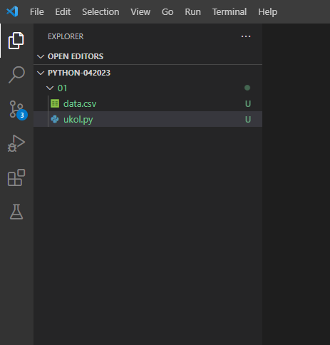
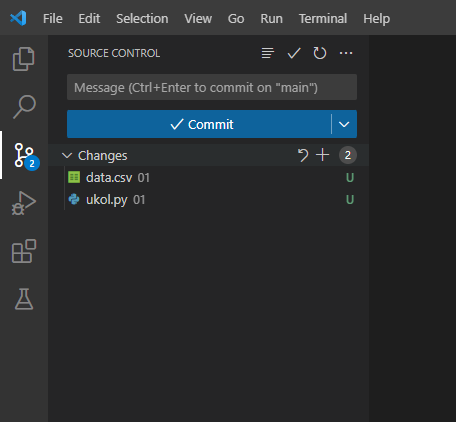
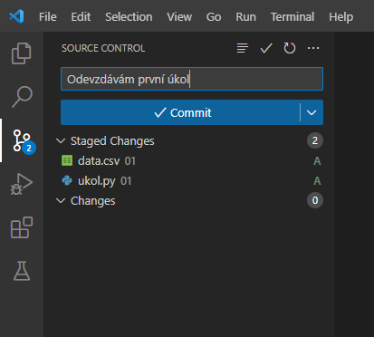
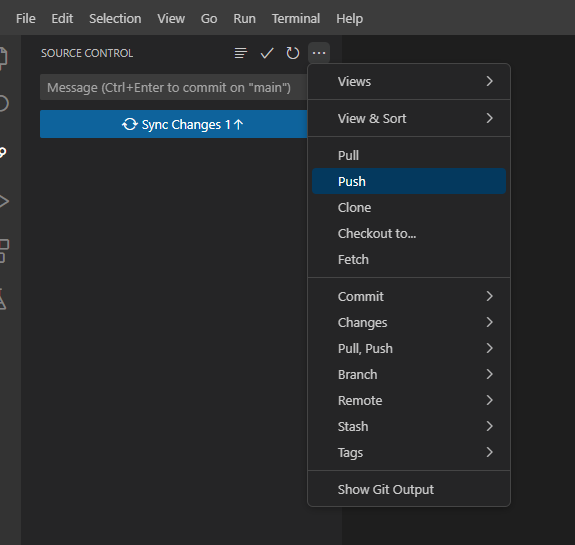

# Odevzdávání úkolů

## Založení repozitáře

Pro založení repozistáře je nutná registrace na serveru [Github.com](https://github.com/). Registraci provedeš kliknutím na tlačítko Sign up na titulní stránce. Poté následuje klasický formulář se zadáním e-mailu, hesla atd.

Po registraci a přihlášení je třeba vytvořit nový repizitář. To provedeš kliknutím na tlačítko `New` v levém sloupci. Poté vyplň název repozitáře (např. `python-042023`) a vyber, zda má být adresář veřejný (Public, viditelný všem) nebo soukromý (Private, viditelný pouze pro lidi, které do něj přidáš).

## Přidání kouče/koučky do repozitáře

Přidání provedeš tak, že si otevřeš svůj repozitář na GitHubu, klikneš na `Settings`, poté na `Manage access` a tam na tlačítko `Invite a collaborator`.

Otevře se okno, do kterého zadej e-mail nebo přihlašovací jmého konkrétního kouče nebo lektora.

## Klonování repositáře

Zkopíruj si adresu repositáře. Tu najdeš po otevření repozitáře. V závislosti na tom, jestli je repositář prázdný, získat adresu buť na titulní stránce nebo po kliknutí na zelené tlačítko Code.

Otevři si terminál a v nějaké adresáři, kde chceš mít ukoly umístěné, zadej příkaz `git clone X`, kde `X` nahraď adresou respositáře.

Poté si adresář otevři ve Visual Studio Code.

## Nahrání úkolu na GitHub

Vytvoř si nový adresář s číslem úkolu (např. `Ukol1`).

Vytvoř si soubor pro uložení ukolu (např. `ukol.py`).

V nově otevřeném editoru napiš program. Až budeš s úkolem spokojený(á), můžeš ho nahrát na GitHub. Nejprve klikni na ikonku `Source Control` vlevo. Poté myší najeď k nápisu `Changes`. Objeví se ikona `+`, na kterou klikneš. Tím přidáš soubory do `Staged Changes`, tj. mezi soubory, které jsou určené k nahrání na Git.

Poté zadej nějakou zprávu od okna `Message` (např. `Odevzdávám první úkol`) a klikni na tlačítko `Commit`.

Poté můžeš kliknout `Sync Changes`, alternativně (např. pokud vidíš nějakou chybovou zprávu) můžeš kliknout na ikonu tří teček a poté vyber možnost `Push`.

Poté vytvoř nové Issue ve svém repozitáři. Do názvu zadej název úkolu a v textu napiš přezdívku tvého kouče/koučky se zavináčem. Tím zajistíš, že kouč/koučka bude informován o založení issue e-mailem. Dále můžeš využít možnost `Assignees` a vybrat svého kouče/koučku. Pokud svého kouče/koučku nevidíš, je potřeba jej přidat do repozitáře, viz postup v podkapitole **Přidání kouče/koučky do repozitáře**.

## Zadání úkolů

### Úkol 1

V souboru [data.csv](data.csv) máš data o hodnotách finančních indikátorů 100 největších společností obchodovaných na americké burze. Naším cílem je zjistit, které indikátory nejvíce ovlivňují cenu a vytvořit model, který odhadne cenu akcie na základě hodnot finančních indikátorů.

Jeden z indikátorů je označený jako *Y* a je poměrem ceny a účetní hodnoty akcie. Ostatní indikátory jso následující:

* běžná likvidita (Current Ratio, *CR*),
* zadluženost (Debt to Assets, *DA*),
* finanční páka (Financial Leverage, *FL*)
* provozní zisková marže (Operating Profit Margin, *OPM*),
* obrat pohledávek (Receivables Turnover, *RT*),
* obrat celkových aktiv (Total Assets Turnover, *TAT*).

#### Část 1

Vytvoř korelační matici a podívej se, který ukazatel má největší hodnotu na cenu akcie.

#### Část 2

Vytvoř regresní model, který bude mít koeficient *Y* jako vysvětlovanou proměnnou. Do modelu vlož hodnoty ostatních indikátorů jako vysvětlující proměnné. Dále přidej Sektor (poslední sloupec) jako vysvětlující proměnnou s využitím One Hot Encoding.

- S využitím modulu `scipy` vytvoř regresní model a zobraz si tabulku se souhrnem významů. Podívej se na hodnoty koeficientů a na výsledky testu statistické významnosti koeficientů. Pokud je některý koeficient (nebo více koeficientů) nevýznamný, sestav nový model bez tohoto koeficientů (případně beze všech nevýznamných koeficientů).
- Pro všechna data odhadni ukazatel *Y* s využitím tvého modelu a odhadnuté ceny vlož do původní tabulky s daty. Dále vypočítej rozdíl mezi odhadem koeficientu a jeho skutečnou hodnotou. Najdi akcii, kde je tento rozdíl největší (tj. hledáme akcii, které náš model predikuje výrazně vyšší cenu než jaká je ve skutečnosti, tato akcie je potenciálně na trhu podhodnocená).
- **Bonus 1:** Sestav model s využitím robustní regrese. Opět proveď vyřazení koeficinetů, které nejsou statisticky významné, a sestav model pouze s významnými koeficienty. Vlož odhady cen do původních dat a opět najdi potenciálně nejvíce podhodnocenou akcii. Jde v případě robustní regese o stejnou akcii, nebo se akcie liší?
- **Bonus 2:** Použij původní (tedy "nerobustní") model a vyčísli Cookovu vzdálenost pro všechny hodnoty. Vyřaď všechny akcie s Cookovou vzdáleností vyšší než 1 a přepočítej regresní model. Nakonec opět najdi potenciálně nejvíce podhodnocenou akcii a podívej se, jestli jde o stejnou akcii jako u předchozích modelů.
